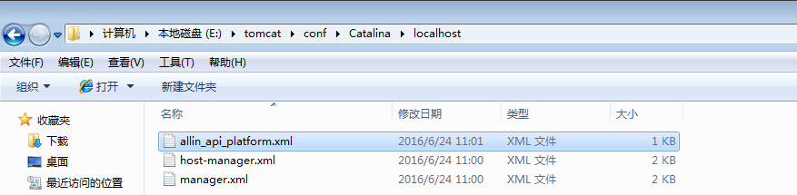

##### Tomcat部署项目有三种方式

* 直接把项目放在默认的tomcat的webapps下。

    * 在访问的时候通过，主机号+端口号+项目名称访问
    * 修改项目的名称为ROOT的话，就可以直接通过主机号+端口号访问

* 通过新建配置XML的文件，配置demo.xml的文件，

    * 方式一: 把文件放在webapps下面
    * 方式二: 放在work\Catalina\localhost的下面，例如:

        ``
        <Context docBase="test" path="/test"  reloadable ="false" / >
        ``
    * ``Tips``: 对于方式二来说访问该工程使用的是的路径要求和文件的名称一致。比如我有一个文件名为allin_api.xml的文件

       ``
        <Context path="/" docBase="E:/eclipsespace/allin_api_platform/WebRoot"
                 debug="5"
                 reloadable="true"
                 crossContext="true">
        </Context>
        ``

        访问的时候需要使用

        [allin_api](http://127.0.0.1:18080/allin_api/services/qiniu/storage/v2/getToken)

        

* 修改conf/server.xml文件，例如
    ````
        <Context path="/" docBase="E:/eclipsespace/allin_api_platform/WebRoot"
                   debug="5"
                   reloadable="true"
                   crossContext="true">
        </Context>
    ````
    * ``Tips``: 这里的Path的值代表的是项目的访问的路径